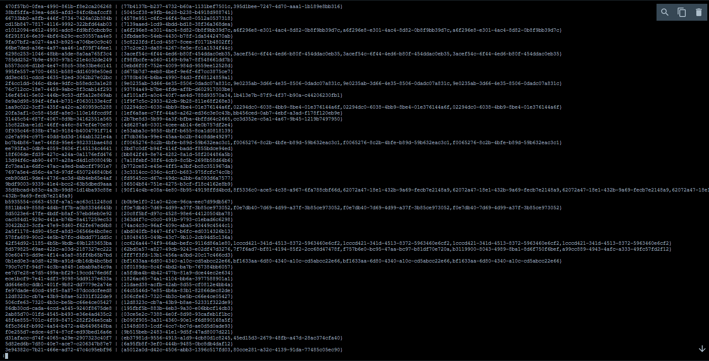

# Проект соответствия Typesense

## Обзор

Этот проект представляет собой надежное решение для бэкенда с использованием FastAPI, интегрированное с PostgreSQL и Typesense для эффективного хранения и поиска данных. Он включает в себя функции миграции, управление зависимостями и проверки качества кода, все это работает без проблем в окружении Docker.

## Шаги для загрузки XML и проведения соответствия

1. **Загрузите XML в форму файла:** Перейдите на страницу загрузки и выберите ваш XML файл. Приложение распарсит файл и загрузит данные в систему, обрабатывая по 1000 записей за итерацию для повышения эффективности.
2. **Проведите соответствие:** После загрузки данных используйте функциональность соответствия для поиска в Typesense. Введите ваши критерии поиска, и приложение извлечет и отобразит соответствующие совпадения, обеспечивая быстрый доступ к необходимой информации.

## Особенности

- **Миграции**: Обрабатывает миграции как для Typesense, так и для PostgreSQL.
- **Управление зависимостями**: Использует Poetry для управления зависимостями проекта.
- **Docker-Compose**: Упрощает процесс разработки и развертывания.
- **Асинхронный бэкенд**: Построен с использованием FastAPI для высокопроизводительных асинхронных операций.
- **Хуки качества кода**: Интегрирует `isort`, `black` и `flake8` для поддержания качества кода.
- **Веб-страницы**:
  - Главная страница
  - Загрузка XML (пакетная обработка 1000 записей за итерацию)
  - Функциональность поиска совпадений с Typesense

## Установка

### Предварительные требования

- Docker
- Docker Compose

## Запуск приложения

1. **Клонируйте репозиторий**:
   ```bash
   git clone https://github.com/vladgenyuk/Testwork_typesense
   ```

2. **Запустите docker-compose**:
   ```bash
   docker-compose up -d --build
   ```

## Миграции

### Typesense и PostgreSQL

Миграции для обеих баз данных обрабатываются автоматически.

## Качество кода

Этот проект включает хуки для поддержания качества кода. Вы можете запускать их вручную или настроить на автоматический запуск при предвходе:

## Веб-страницы

### Главная страница

Главная страница предоставляет обзор приложения и его функций.

### Загрузка XML

Вы можете загружать XML файлы для пакетной обработки. Приложение читает 1000 записей за итерацию для повышения эффективности.

### Поиск совпадений

Используйте функциональность поиска для нахождения совпадений с Typesense, что позволяет быстро и точно извлекать данные.

### Самые крупные совпадения, которые я нашел (список UUID и похожих SKU в PostgreSQL после соответствия)


### Примеры
1) Rage2.
2) Электронная книга Amazon Kindle 11 16Gb SO Black с обложкой ReaderONE

